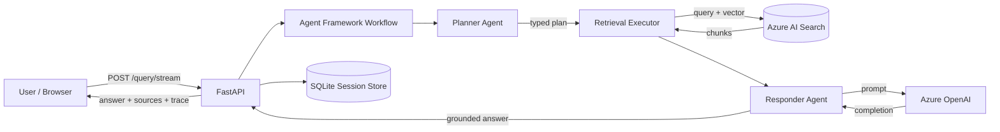
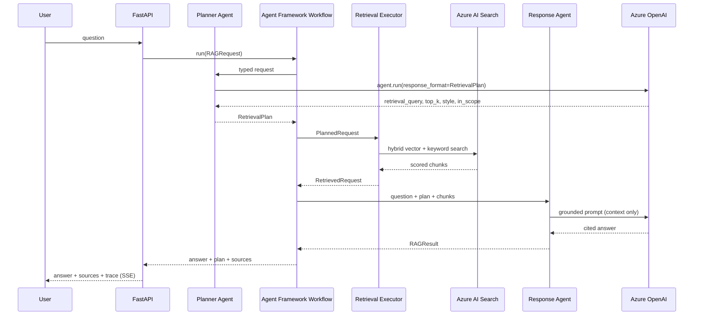

# AI Engineer — Architecture Document

A Retrieval-Augmented Generation (RAG) assistant built with **Microsoft Agent Framework**.
It answers questions grounded in a curated knowledge base (e.g. NIST CSF 2.0 content) using
**Azure OpenAI** for inference and **Azure AI Search** for retrieval, behind a FastAPI
backend and a React (Vite + MUI) frontend.

---

## 1. System Design

### High-Level Components

| Layer | Technology | Responsibility |
|-------|-----------|----------------|
| Frontend | React + Vite + MUI | Chat UI, starter prompts, live agent trace timeline |
| API | FastAPI | `/query`, `/query/stream` (SSE), `/health`; request validation, session orchestration |
| Orchestration | Microsoft Agent Framework `WorkflowBuilder` | Runs the typed Planner → Retriever → Responder graph |
| Agents | Agent Framework `OpenAIChatCompletionClient.as_agent` | Creates planner, responder, and summarizer agents |
| Inference | Azure OpenAI | Chat completions invoked through Agent Framework |
| Retrieval | Azure AI Search | Hybrid (vector + keyword) search over embedded chunks |
| Embeddings | `sentence-transformers/all-MiniLM-L6-v2` | Query + document embeddings |
| Session state | SQLite (`session_store`) | Messages and rolling summaries per session |
| Ingestion | `backend/ingestion/azure_search/ingest_azure_search.py` | Parquet → chunk → embed → index pipeline |

### Data Flow

### Configuration

Runtime behavior is driven by `backend/config/rag_runtime_config.json` (`top_k`, score
thresholds, retries, and Azure OpenAI/Search settings). Secrets and endpoints are supplied
via environment variables (`.env`): `AZURE_OPENAI_ENDPOINT`, `AZURE_OPENAI_API_KEY`,
`DEPLOYMENT_NAME`, and `AZURE_SEARCH_API_KEY`. Paths are resolved relative to the repo root
via `backend/paths.py`, keeping configuration environment-agnostic.

### Offline Ingestion Pipeline

Parquet sources in `data/raw/` are profiled, chunked (token-aware, `chunk_size=400`,
`overlap=60`), embedded in batches, and indexed into Azure AI Search. Outputs include
`chunks.jsonl`, a `source_profile.json`, and an `ingest_manifest.json` for reproducibility.
Ingestion is decoupled from serving so the query path stays read-only.

---

## 2. Agent Interaction Flow

The pipeline is a deterministic Microsoft Agent Framework graph. `WorkflowBuilder` connects
three typed executors and emits the existing application trace events at every step.

1. **Planner Agent** — A genuine Microsoft Agent Framework agent created with
   `OpenAIChatCompletionClient.as_agent`. It converts the raw question into a Pydantic
   `RetrievalPlan` through the framework's structured-output support.
2. **Retrieval Executor** — A deterministic Agent Framework `Executor` that runs hybrid
   search against Azure AI Search. It keeps chunks scoring
   at or above `azure_search_min_score`; if none pass, it applies a fallback
   (`azure_search_fallback_min_score`) to surface the single best chunk, else returns empty
   (triggering an honest "not enough context" answer).
3. **Responder Agent** — A second Agent Framework agent that receives a grounded prompt
   containing only retrieved context, the conversation summary, and recent turns. It cites
   sources (`[source_file#row_index]`) and admits weak context. A third framework agent
   creates rolling conversation summaries.

**Conversational memory:** For sessions, the API keeps the most recent messages verbatim
(`RECENT_VERBATIM_MESSAGES=8`) and, once history exceeds a threshold, batches older messages
into an LLM-generated rolling summary stored in SQLite. This bounds prompt size while
preserving durable goals and decisions.

**Observability:** Every stage emits structured trace events (prompts, durations, scores,
retries). These stream to the UI via Server-Sent Events (`/query/stream`), giving
step-by-step transparency into each answer.

---

## 3. Security Considerations

- **Managed cloud services:** Inference and retrieval run on Azure OpenAI and Azure AI
  Search, keeping data within a governed Azure boundary rather than arbitrary third parties.
- **Secret management:** Endpoints and API keys are read from environment variables, never
  committed to source. In production these should come from Azure Key Vault or Container
  Apps secrets.
- **Input validation:** Pydantic models enforce request schema (`question` min length,
  typed fields), rejecting malformed payloads at the boundary.
- **CORS allow-list:** Only configured origins are permitted, limiting cross-origin abuse.
- **Grounding as an injection control:** The Response Agent is constrained to answer only
  from retrieved context and to cite sources, reducing hallucination and limiting the blast
  radius of adversarial content embedded in documents.
- **Error containment:** Exceptions are surfaced as HTTP 500 without leaking internals;
  upstream failures (Azure timeouts) degrade gracefully with actionable guidance.
- **Hardening backlog (recommended):** authentication/authorization for multi-user
  deployments, rate limiting, request-size caps, prompt-injection/output filtering, and TLS
  termination when exposed beyond localhost.

---

## 4. Scalability Considerations

- **Stateless request path:** The core RAG pipeline is stateless per request; horizontal
  scaling is achievable by running multiple API replicas behind a load balancer, with
  session state externalized (SQLite → Postgres/Redis for concurrency).
- **Managed retrieval tier:** Azure AI Search scales independently of the API and handles
  vector + keyword search for larger corpora and shared access.
- **Typed retrieval boundary:** The `VectorStore` protocol keeps the workflow executor
  decoupled from retrieval details, while serving uses Azure AI Search directly.
- **Decoupled ingestion:** Batch ingestion scales independently of serving and can be re-run
  to refresh the index; the serving path never mutates the store.
- **Streaming responses:** SSE streaming keeps the UI responsive and lets long generations
  progress incrementally rather than blocking on a single response.
- **Tunable cost/latency knobs:** `top_k`, score thresholds, deployment choice, timeouts,
  and retry counts are config-driven, enabling trade-offs between quality, latency, and cost.

---

## 5. Governance Controls

- **Traceability & auditability:** Full per-stage trace (prompts, retrieved chunks with
  scores, retries, durations) provides an audit trail for every answer.
- **Source attribution:** Answers cite `source_file#row_index`, making claims verifiable
  against the underlying knowledge base.
- **Reproducible knowledge base:** Ingestion emits a manifest and source profile, so the
  exact corpus state behind an answer can be reconstructed and version-controlled.
- **Configuration as governance:** Deployment, thresholds, and retrieval limits live in
  versioned JSON config, giving change control over model behavior and grounding strictness.
- **Honest abstention:** When retrieval confidence is low, the system explicitly declines
  rather than fabricating, aligning with responsible-AI expectations.
- **Data lifecycle:** Session store is initialized on startup (reset-capable) and scoped per
  session, supporting clear boundaries for retention and deletion.

---

## 6. Containerization & Deployment

The backend and frontend each ship with a `Dockerfile` so they can run as isolated images.
The containers are intended for **Azure Container Apps** (Azure's serverless container
service) eventually, but run identically on any local Docker host during development.

| Image | Base | Serves | Port |
|-------|------|--------|------|
| `backend/Dockerfile` | `python:3.12-slim` | FastAPI via Uvicorn (`backend.app.api:app`) | 8000 |
| `frontend/Dockerfile` | `node:20` build → `nginx:alpine` | Static Vite build | 80 |

- **Backend** copies the repo, installs `backend/requirements.txt`, and runs Uvicorn. Azure
  credentials are injected as environment variables (Container Apps secrets / Key Vault), not
  baked into the image.
- **Frontend** builds the Vite app (with `VITE_API_BASE_URL` pointing at the backend) and
  serves the static bundle through nginx with SPA fallback routing.
- On Azure Container Apps each image becomes its own container app; the frontend calls the
  backend over its public/internal ingress URL, and both scale independently.

---

## Summary

The system favors **transparency, grounding, and explicit orchestration**: Microsoft Agent
Framework agents and a typed `WorkflowBuilder` graph coordinate planning and grounded
response generation around deterministic Azure AI Search retrieval. Streaming traces,
configuration-driven behavior, decoupled ingestion, and containerized services make the
application straightforward to inspect, scale, and deploy.
