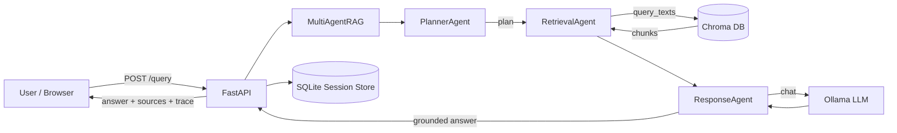

# AI Engineer — Architecture Document

A fully local, privacy-preserving **multi-agent Retrieval-Augmented Generation (RAG)**
assistant. It answers questions grounded in a curated knowledge base (e.g. NIST CSF 2.0
content) using a local LLM served by Ollama, a Chroma vector store, and a FastAPI backend
with a React (Vite + MUI) frontend. No data leaves the host machine.

---

## 1. System Design

### High-Level Components

| Layer | Technology | Responsibility |
|-------|-----------|----------------|
| Frontend | React + Vite + MUI | Chat UI, starter prompts, live agent trace timeline |
| API | FastAPI | `/query`, `/query/stream` (SSE), `/health`; request validation, session orchestration |
| Orchestration | `MultiAgentRAG` | Coordinates Planner → Retriever → Responder pipeline |
| Inference | Ollama (`granite4.1:3b`) | Local chat completions for planning, answering, summarizing |
| Retrieval | Chroma or Azure AI Search | Vector similarity search over embedded chunks |
| Embeddings | `sentence-transformers/all-MiniLM-L6-v2` | Query + document embeddings |
| Session state | SQLite (`session_store`) | Messages, rolling summaries per session |
| Ingestion | `backend/ingestion/chroma/ingest_chroma.py` and `backend/ingestion/azure_search/ingest_azure_search.py` | Parquet → chunk → embed → index pipeline |

### Data Flow

### Configuration

Runtime behavior is driven by `backend/config/rag_runtime_config.json` (vector store
provider, `top_k`, retrieval thresholds, Ollama model/timeout/retries). Ingestion is driven
by provider-specific config files under `backend/ingestion/chroma/` and
`backend/ingestion/azure_search/`.
Paths are resolved relative to the repo root via `backend/paths.py`, keeping configuration
environment-agnostic.

### Offline Ingestion Pipeline

Parquet sources in `data/raw/` are profiled, chunked (token-aware, `chunk_size=400`,
`overlap=60`), embedded in batches, and persisted to `data/chroma_db/`. Outputs include
`chunks.jsonl`, a `source_profile.json`, and an `ingest_manifest.json` for reproducibility.
Ingestion is decoupled from serving so the query path stays read-only.

---

## 2. Agent Interaction Flow

The pipeline is a deterministic three-stage chain with emitted trace events at every step:

1. **Planner Agent** — Converts the raw question into a structured `RetrievalPlan`
   (`retrieval_query`, `top_k` clamped 1–8, `response_style`). Uses JSON-mode LLM output
   with a safe fallback plan if the model errors or returns invalid JSON.
2. **Retrieval Agent** — Runs vector search against Chroma. Applies a **strict distance
   filter** (`max_distance=0.5`); if nothing passes, it applies a **fallback threshold**
   (`0.7`) to surface the single best chunk, else returns empty (triggering an honest
   "not enough context" answer).
3. **Response Agent** — Builds a grounded prompt containing only retrieved context, the
   conversation summary, and recent turns. It instructs the model to cite sources
   (`[source_file#row_index]`) and to admit weak context. Retries on transient failures.

**Conversational memory:** For sessions, the API keeps the most recent messages verbatim
(`RECENT_VERBATIM_MESSAGES=8`) and, once history exceeds a threshold, batches older
messages into an LLM-generated rolling summary stored in SQLite. This bounds prompt size
while preserving durable goals and decisions.

**Observability:** Every stage emits structured trace events (prompts, durations,
distances, retries). These stream to the UI via Server-Sent Events (`/query/stream`),
giving full step-by-step transparency into each answer.

---

## 3. Security Considerations

- **Local-first / data residency:** All inference, embeddings, retrieval, and session data
  run on-device. No third-party API calls, so no knowledge-base or prompt data egress.
- **Input validation:** Pydantic models enforce request schema (`question` min length,
  typed fields), rejecting malformed payloads at the boundary.
- **CORS allow-list:** Only the local dev origins (`127.0.0.1:5173`, `localhost:5173`) are
  permitted, limiting cross-origin abuse.
- **Grounding as an injection control:** The Response Agent is constrained to answer only
  from retrieved context and to cite sources, reducing hallucination and limiting the blast
  radius of adversarial content embedded in documents.
- **Error containment:** Exceptions are surfaced as HTTP 500 without leaking internals to
  end users beyond the message; upstream failures (Ollama timeouts) degrade gracefully with
  actionable guidance instead of crashing.
- **Hardening backlog (recommended):** add authentication/authorization for multi-user
  deployments, rate limiting, request-size caps, prompt-injection/output filtering, secret
  management for any future remote providers, and TLS termination when exposed beyond
  localhost.

---

## 4. Scalability Considerations

- **Stateless request path:** The core RAG pipeline is stateless per request; horizontal
  scaling is achievable by running multiple API workers behind a load balancer, with
  session state externalized (SQLite → Postgres/Redis for concurrency).
- **Pluggable vector store:** `create_vector_store` factory + `VectorStore` Protocol allow
  swapping Chroma for a networked/managed vector DB (e.g. for larger corpora or shared
  access) without touching agent logic.
- **Decoupled ingestion:** Batch ingestion scales independently of serving and can be
  re-run to refresh the index; the serving path never mutates the store.
- **Streaming responses:** SSE streaming keeps the UI responsive and lets long generations
  progress incrementally rather than blocking on a single response.
- **Tunable cost/latency knobs:** `top_k`, distance thresholds, model choice,
  timeouts, and retry counts are config-driven, enabling trade-offs between quality,
  latency, and hardware footprint.
- **Bottlenecks to plan for:** local LLM throughput (GPU/CPU bound) and single-writer
  SQLite. Production scale would move inference to a pooled/GPU-backed serving tier and
  migrate session storage to a concurrent database.

---

## 5. Governance Controls

- **Traceability & auditability:** Full per-stage trace (prompts, retrieved chunks with
  scores, retries, durations) provides an audit trail for every answer, supporting review
  and incident analysis.
- **Source attribution:** Answers cite `source_file#row_index`, making claims verifiable
  against the underlying knowledge base.
- **Reproducible knowledge base:** Ingestion emits a manifest and source profile, so the
  exact corpus state behind an answer can be reconstructed and version-controlled.
- **Configuration as governance:** Model, thresholds, and retrieval limits live in
  versioned JSON config, giving change control over model behavior and grounding strictness.
- **Honest abstention:** When retrieval confidence is low, the system explicitly declines
  rather than fabricating, aligning with responsible-AI expectations.
- **Data lifecycle:** Session store is initialized on startup (reset-capable) and scoped
  per session, supporting clear boundaries for retention and deletion.
- **Governance backlog (recommended):** role-based access, retention/PII policies, an
  evaluation harness for answer quality/grounding regression, and model-version approval
  gates before promotion.

---

## Summary

The system favors **local privacy, transparency, and modularity**: a clear three-agent
pipeline (plan → retrieve → respond), grounded and cited answers, full observability via
streaming traces, and configuration-driven behavior. Its Protocol-based abstractions and
decoupled ingestion make it straightforward to scale storage, inference, and session state
independently as requirements grow.
